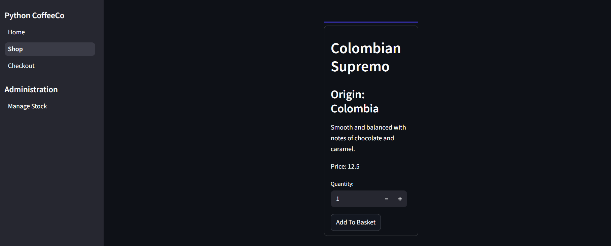
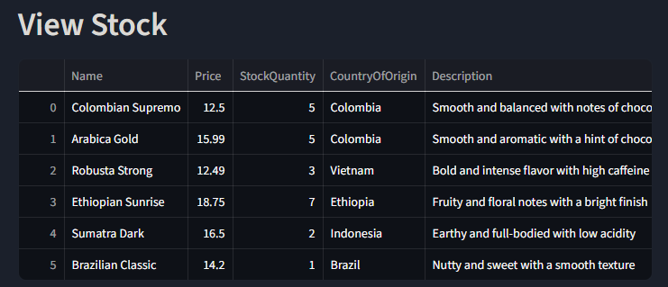

# Python Full Stack tutorial with InterSystems IRIS

## Installation

To try the demo application, run

```sh
git clone https://github.com/gabriel-ing/python_coffeeco.git
cd python_coffeeco
```

This project connects to an instance of InterSystems IRIS running on superserver port 1972. Either:

- Use an existing, running instance

- Start a new instance:  

    ```sh
    docker run --name coffeeco-iris --publish 1972:1972 --publish 52773:52773 -d intersystems/iris-community:latest-em
    ```

- Use docker-compose (for a vanilla IRIS install)

    ```sh
    docker-compose build
    docker-compose up -d
    ```

This is a UV python project, so if you don't have it installed, install it. Then:

```sh
uv sync
```

Then:

1. Create the data table

```sh
uv run create_table.py
```

2. Start Streamlit

```sh
uv run streamlit run main.py
```

3. View the application at http://localhost:8051

## Overview

This is a dummy online shop for a fictional coffee company, Python CoffeeCo. The front end is built with [streamlit](https://streamlit.io/), a pure Python framework for creating elegant front-ends with very simple python code.

The application connects to an instance of InterSystems IRIS for the back-end database. Both relational and native object connections are demonstrated. 

### Caveats

- Streamlit is designed to be easy to use, but does come with a trade-off of limited customisability. This isn't the greatest use case for the framework. The good news is, the connection to IRIS can be used in a similar way with Flask, Django or Reflex. 

- Security is not considered in this application. Before production, one should:

    - Create Roles-based access to SQL tables in IRIS 
    - Change IRIS credentials and hide them as environmental variables
    - Change the admin password from "1234" (note this is also hardcoded in the streamlit code).

- No user or payment details are collected.

> [!WARNING]
> This is a demo, not a production application!

# Guide

## Step 1: Creating a data table

We are connecting to the running InterSystems IRIS instance with the DB-API. This allows us to run SQL commands and queries.

During the set-up, we ran `create_table.py`. Lets take a look what this does:

```python
import iris

server = "localhost"
port = 1972 # Binary superserver connection port
namespace = "USER" # Default namespace
username = "SuperUser" # Default Username
password = "SYS" # Default Password

connection = iris.connect(server, port, namespace, username, password)
cursor = connection.cursor() 
```

Now we have a cursor object, we can execute SQL queries:

```python
## SQL query to create a table 
create_table_query  = """CREATE TABLE coffeeco.Inventory ( 
    Name VARCHAR(50), 
    Price DOUBLE, 
    StockQuantity Integer,
    CountryOfOrigin VARCHAR(50), 
    Description VARCHAR(500) 
    )"""
cursor.execute(create_table_query)
```

We also add a single row of data: 

```python
## Insert query
insert_query = """INSERT INTO coffeeco.Inventory 
                (Name, Price, StockQuantity, CountryOfOrigin, Description)
                VALUES (?, ?, ?, ?, ? )""" ## ? Is a placeholder for a value passed at runtime

## List of values to insert
values = ["Colombian Supremo", 12.50, 5, "Colombia","Smooth and balanced with notes of chocolate and caramel."]

## Execute insertion
cursor.execute(insert_query, values) ## Values for ? placeholders passed in as a list
```

## Explore the web-application

With the application running, take a look at the homepage, then click the "Shop" button, either on the main page or the sidebar.



You should see a single product. 

Lets add some more. Choose "Manage Stock" from the sidebar. 

## Manage stock page

You will be prompted for login details - enter 

- Username: admin
- Password: 1234

You will see a table showing the inventory, and we can see theres only a single item currently in stock. Luckily, an order has just come in. Lets upload the order manifest to the inventory. Under Load Stock CSV, click browse files, then navigate to the file `python_fullstack/data/order-manifest.csv`.  

You should see a preview of the file pop up, check that it looks ok, then click `Add To Database`

And bam - we've added the order to the stock. 

### Under the hood 

This page uses two different methods to connect relationally. Data is retrieved using sqlalchemy:

```python
def get_stock() -> pd.DataFrame:

    server = "localhost"
    port = 1972
    namespace = "USER"
    username = "SuperUser"
    password = "SYS"

    db_url = f"iris://{username}:{password}@{server}:{port}/{namespace}"
    sql = """SELECT * FROM coffeeco.Inventory"""

    engine = create_engine(db_url)
    
    df = pd.read_sql(sql, engine)
    return df
```

Data is uploaded via DB-API cursor: 

```python
def add_to_database(df):
    insert_query = f"INSERT INTO coffeeco.Inventory (Name, Description, CountryOfOrigin, Price, StockQuantity) VALUES (?, ?, ? , ?, ?)"
    df_lists = df.values.tolist()

    conn = iris.connect("localhost", 1972, "USER", "SuperUser", "SYS")
    cursor = conn.cursor()
    print(df_lists)
    status = cursor.executemany(insert_query, df_lists)
    
    st.write("Added data to database!")
```

## Return to Shop

We can now see our products in the shop!

Try adding something to the basket, feel free to change the quantities.

### Under the hood

Here we use a Python-native connection and an object model to retrieve products. 

First we get the product IDs using DB-API: 

```python
conn = iris.connect("localhost", 1972, "USER", "SuperUser", "SYS")
cursor = conn.cursor() 

cursor.execute("SELECT ID from coffeeco.Inventory")
ids = cursor.fetchall()
ids = [x[0] for x in ids] 
```
We then iterate over the IDs and fetch each one as an object: 

```python
i = 1
for id in ids:
    try:
        item = irispy.classMethodObject("coffeeco.Inventory", "%OpenId", id)
        # print(item.get("Name")) 
        write_column(i,id, item)
        i+=1
    except Exception as e: 
        break

```

And for each one, create a product tile. We access the values with `item.get("{property}")`

```python
  with st.container(height=500):

            ## Retrieve product name
            st.header(item.get("Name"))

            ## Retrieve other product items
            st.subheader(f"Origin: {item.get("CountryOfOrigin")}")
            st.write(item.get("Description"))
            st.write(f"Price: {item.get("Price")}")
```

And so on...


The basket is tracked and cached in `st.session_state.basket`.

## Checkout

Now lets take a look at the checkout. This is a dummy application, so lets ignore the fact we don't take any customer information or payment details.

We should see all the items we added to the basked before, with a total calculated. Make a note of which items you added to the basket.

Hit Pay Now! and see what happens.

You're redirect to an order confirmation page! Great.

Lets double check that the stock. Return to the `Manage Stock` page, log in again if you need to and have a look at the stock table.

This was the table when you first uploaded the order-manifest:



Hopefully, you will see the quantity of whichever items you ordered go down. Maybe you even ran out of stock! 

### Under the hood

Again, we are using the iris-native object model with `%OpenId()` to retrive the data. We doublecheck whether the item is out of stock, and if so remove it from the database with `%DeleteId()`.

```python
    connection = iris.connect("localhost", 1972, "USER", "SuperUser", "SYS")
    irispy = iris.createIRIS(connection)

    if st.button("Pay Now!"):
        for id in st.session_state.basket:
            item = irispy.classMethodObject("coffeeco.Inventory", "%OpenId", id)

            if not item:
                st.switch_page("pages/hidden/error.py")
                break

            if st.session_state.basket[id]["Quantity"] == item.get("StockQuantity"):
                irispy.classMethodVoid("coffeeco.Inventory", "%DeleteId", id)
            else:
                new_quantity = item.get("StockQuantity") - st.session_state.basket[id]["Quantity"]
                item.set("StockQuantity", new_quantity) 
                item.invokeVoid("%Save")
```
